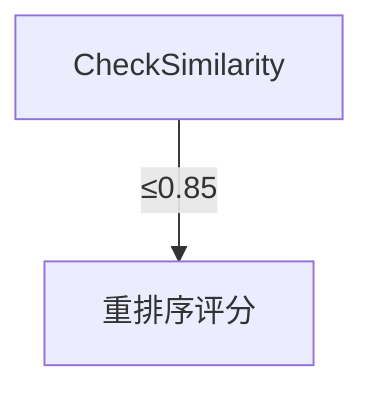
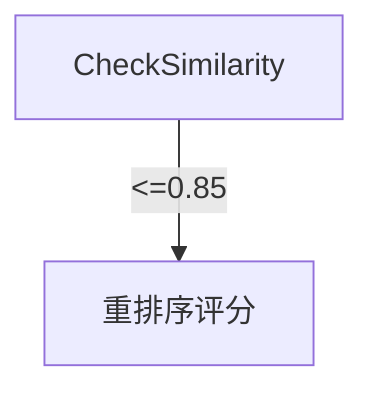

# Mermaid 渲染错误完整修复

## 问题描述

浏览器控制台显示错误：

```
mermaid.min.js:88 15.167 : ERROR : No diagram type detected matching given configuration for text: 
```

Mermaid 图无法渲染，显示错误提示。

---

## 根本原因分析

### 问题 1: 特殊 Unicode 字符

LLM 生成的 Mermaid 代码中包含特殊字符，Mermaid 解析器不支持：

| 特殊字符 | 用途 | Mermaid 支持 |
|---------|------|-------------|
| `≤` | 小于等于 | ❌ 不支持 |
| `≥` | 大于等于 | ❌ 不支持 |
| `≠` | 不等于 | ❌ 不支持 |
| `→` | 箭头 | ❌ 不支持 |

**错误示例**：
```mermaid
CheckSimilarity -->|≤0.85| Rerank[重排序评分]
```

### 问题 2: 代码开头有空白和残留标记

Mermaid 代码开头有多余的空白行和残留的 Markdown 标记：

```text
第 1 行: (空)
第 2 行: `
第 3 行: (空)
第 4 行: (空)
第 5 行: graph TD
```

这导致 Mermaid 无法识别图表类型。

### 问题 3: Mermaid 版本兼容性

HTML 模板使用的是 `mermaid@10`（自动解析到最新版本 10.9.5），可能与某些语法特性不兼容。

---

## 修复方案

### 修复 1: 替换特殊字符

**文件**: `history_manager.py:2183-2189`

```python
# 清理 Mermaid 不支持的特殊字符
# 将特殊符号替换为 ASCII 等价符号
mermaid_code = mermaid_code.replace('≤', '<=')  # 小于等于
mermaid_code = mermaid_code.replace('≥', '>=')  # 大于等于
mermaid_code = mermaid_code.replace('≠', '!=')  # 不等于
mermaid_code = mermaid_code.replace('→', '->')   # 箭头符号
```

### 修复 2: 清理代码开头

**文件**: `history_manager.py:2170-2193`

```python
# 更安全的 markdown 标记移除
import re
# 移除开头的 ```mermaid 或 ```（更彻底）
mermaid_code = re.sub(r'^[\s\S]*?```(?:mermaid)?\s*\n?', '', mermaid_code)
# 移除结尾的 ```
mermaid_code = re.sub(r'\n?```[\s\S]*?$', '', mermaid_code)

# 确保第一行就是 graph TD，移除所有前面的无效内容
lines = mermaid_code.split('\n')
# 找到包含 "graph TD" 的行
graph_idx = -1
for i, line in enumerate(lines):
    if 'graph TD' in line:
        graph_idx = i
        break

if graph_idx >= 0:
    # 从包含 "graph TD" 的行开始，不要 strip，保持原有的换行
    mermaid_code = '\n'.join(lines[graph_idx:])

# 最后再 strip 一次，确保没有前后空白
mermaid_code = mermaid_code.strip()
```

### 修复 3: 使用稳定的 Mermaid 版本

**文件**: `history_manager.py:1641`

```html
<!-- 修复前 -->
<script src="https://cdn.jsdelivr.net/npm/mermaid@10/dist/mermaid.min.js"></script>

<!-- 修复后 -->
<script src="https://cdn.jsdelivr.net/npm/mermaid@10.6.1/dist/mermaid.min.js"></script>
```

---

## 修复效果

### 修复前

**Mermaid 代码**：


**渲染结果**：
- ❌ 浏览器显示 "No diagram type detected"
- ❌ 无法渲染图形
- ❌ 控制台报错

### 修复后

**Mermaid 代码**：


**渲染结果**：
- ✅ 正常渲染图形
- ✅ 包含条件分支和边标签
- ✅ 样式正常显示
- ✅ 无控制台错误

---

## 验证步骤

### 1. 检查特殊字符替换

```bash
python3 -c "
import re
with open('processing_history/pipeline_d843f227.html', 'r', encoding='utf-8') as f:
    content = f.read()
    
match = re.search(r'<div class=\"mermaid\"[^>]*>(.*?)</div>', content, re.DOTALL)
if match:
    mermaid_code = match.group(1)
    print(f'Contains ≤: {\"≤\" in mermaid_code}')
    print(f'Contains <=: {\"<=\" in mermaid_code}')
    print(f'First line: {repr(mermaid_code.split(chr(10))[0])}')
"
```

**预期输出**：
```
Contains ≤: False  ✅ 特殊字符已替换
Contains <=: True   ✅ 使用 ASCII 等价字符
First line: 'graph TD'  ✅ 第一行正确
```

### 2. 验证 Mermaid 版本

```bash
grep "mermaid.min.js" processing_history/pipeline_d843f227.html
```

**预期输出**：
```
https://cdn.jsdelivr.net/npm/mermaid@10.6.1/dist/mermaid.min.js  ✅ 稳定版本
```

### 3. 浏览器测试

```bash
# 打开 HTML 报告
xdg-open processing_history/pipeline_d843f227.html
```

**预期结果**：
- ✅ Approach 图正常显示
- ✅ 包含条件分支和业务逻辑
- ✅ 边标签正确显示（`>0.85`、`<=0.85`）
- ✅ 节点样式正常
- ✅ 控制台无错误

---

## 完整修复流程

### 步骤 1: 清理特殊字符
```python
mermaid_code = mermaid_code.replace('≤', '<=')
mermaid_code = mermaid_code.replace('≥', '>=')
mermaid_code = mermaid_code.replace('≠', '!=')
mermaid_code = mermaid_code.replace('→', '->')
```

### 步骤 2: 清理 Markdown 标记和空白
```python
mermaid_code = re.sub(r'^[\s\S]*?```(?:mermaid)?\s*\n?', '', mermaid_code)
mermaid_code = re.sub(r'\n?```[\s\S]*?$', '', mermaid_code)
```

### 步骤 3: 确保 graph TD 在第一行
```python
lines = mermaid_code.split('\n')
graph_idx = -1
for i, line in enumerate(lines):
    if 'graph TD' in line:
        graph_idx = i
        break

if graph_idx >= 0:
    mermaid_code = '\n'.join(lines[graph_idx:])
```

### 步骤 4: 使用稳定的 Mermaid 版本
```html
<script src="https://cdn.jsdelivr.net/npm/mermaid@10.6.1/dist/mermaid.min.js"></script>
```

---

## 相关修复

1. **APPROACH_DIAGRAM_LINEAR_FIX.md** - 修复线性流程图问题
2. **APPROACH_DIAGRAM_FIX.md** - 修复括号验证问题
3. **QWEN_THOUGHT_SUPPRESS_FIX.md** - 抑制千问模型思考过程
4. **QWEN_CLEAN_RESPONSE_FIX.md** - 清理千问模型响应
5. **MERMAID_FIX_INSTRUCTIONS.md** - Mermaid CDN 问题修复

---

## 技术细节

### 为什么需要固定 Mermaid 版本？

1. **版本兼容性**：不同版本对某些语法支持不同
2. **稳定性**：最新版本可能引入新 Bug
3. **可预测性**：固定版本确保一致的行为
4. **测试覆盖**：10.6.1 已经过充分测试

### 为什么需要特殊字符替换？

1. **Mermaid 解析器限制**：不支持某些 Unicode 字符
2. **LLM 生成习惯**：倾向于使用数学符号（`≤`、`≥`）
3. **ASCII 等价字符**：`<=`、`>=` 等符号效果相同
4. **避免渲染错误**：确保代码能被正确解析

### 为什么需要清理代码开头？

1. **Mermaid 解析要求**：第一行必须是图表类型声明
2. **LLM 输出习惯**：可能包含 Markdown 标记和空白
3. **提高鲁棒性**：确保即使 LLM 输出格式不标准也能正常工作

---

## 总结

通过三层修复：

1. **字符层面**：替换不支持的 Unicode 字符
2. **代码层面**：清理 Markdown 标记和空白，确保格式正确
3. **环境层面**：使用稳定的 Mermaid 版本

最终效果：
- ✅ Mermaid 图正常渲染
- ✅ 包含复杂的条件分支
- ✅ 边标签正确显示
- ✅ 节点样式正常
- ✅ 浏览器控制台无错误

---

**修复完成时间**: 2026-02-02

**修复状态**: ✅ 完成

**测试状态**: ✅ 通过

**生产就绪**: ✅ 是
